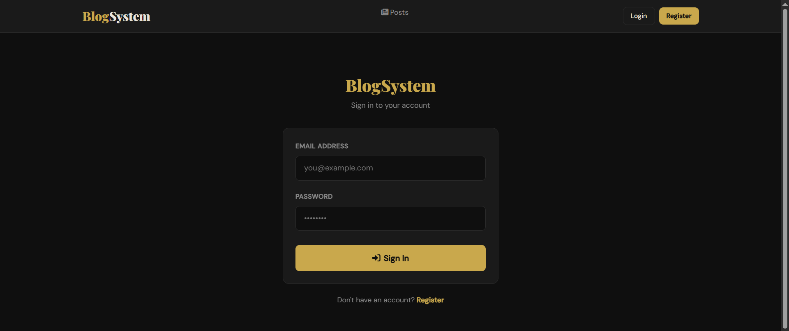
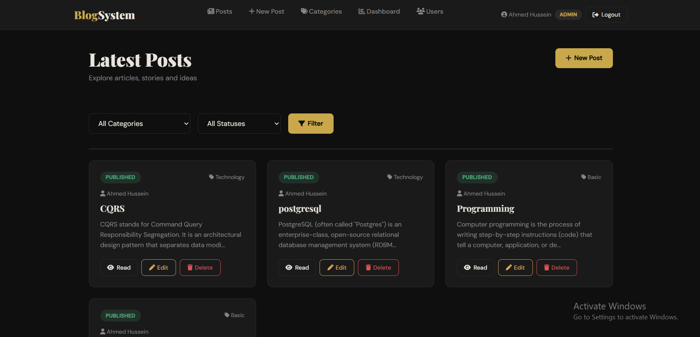
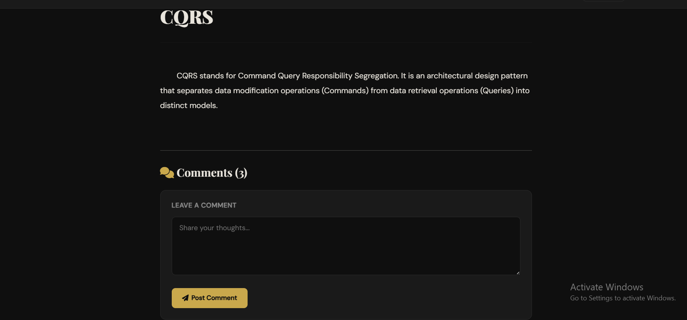
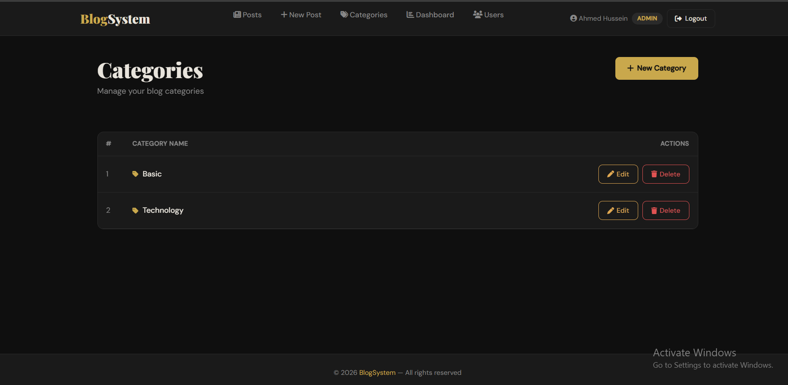
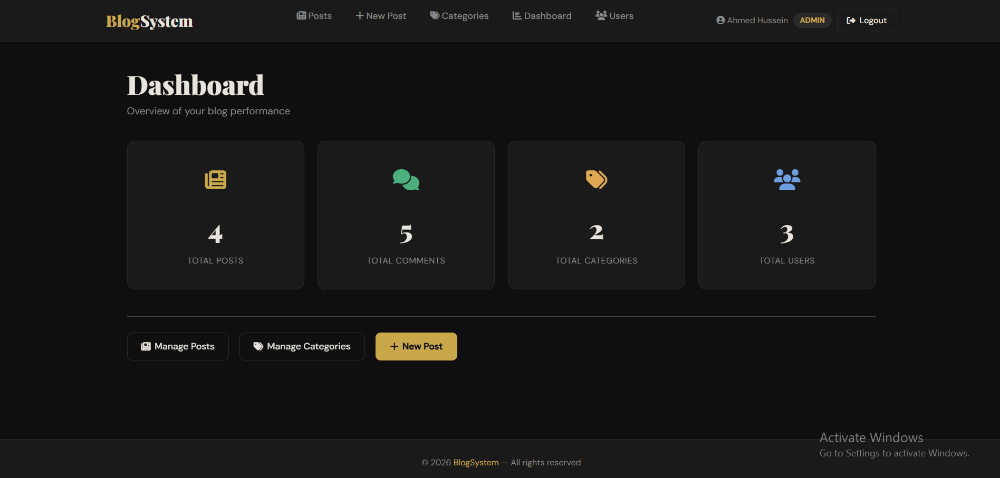
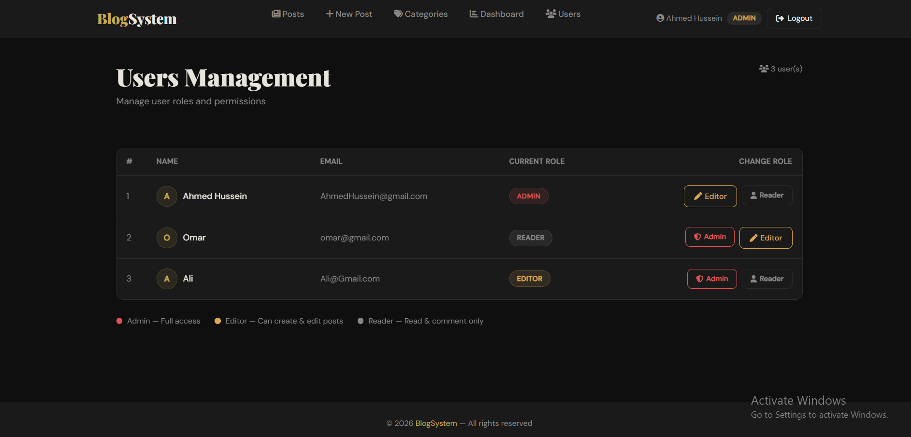

# 📝 BlogSystem

A full-stack blog platform built with **ASP.NET Core** following **Clean Architecture** principles. The system consists of a RESTful Web API backend and an ASP.NET MVC frontend, demonstrating real-world software engineering patterns.

> **Author:** Ahmed Hussein — ASP.NET Core Backend Developer

---

## 🖼️ Screenshots

### Login Page


### Posts Page


### Post Details


### Categories


### Admin Dashboard


### Users Management


---

## 🏗️ Architecture

The solution follows **Clean Architecture** with clear separation of concerns across 7 projects:

```
BlogSystem/
│
├── Blog.Domain                      # Enterprise Business Rules
│   ├── Entities/                    # BlogPost, AppUser, Category, Comment, Tag
│   └── Interfaces/                  # IGenericRepository, IUnitOfWork, ISpecifications
│
├── Blog.Presistance                 # Infrastructure / Data Layer
│   ├── Data/DbContexts/             # BlogDbContext (Identity + EF Core)
│   ├── Data/Configuration/          # Fluent API Entity Configurations
│   ├── Data/DataSeed/               # Identity Roles & Admin Seeder
│   └── Repositories/                # GenericRepository, UnitOfWork
│
├── Blog.Services.Abstraction        # Service Interfaces
│   └── IAuthenticationService, IBlogPostsService, ICommentService...
│
├── Blog.Sevices                     # Business Logic Layer
│   ├── AuthenticationService        # JWT Generation, Register, Login
│   ├── BlogPostsService             # CRUD + Filtering + Pagination
│   ├── CommentService               # Comment Management
│   ├── DashboardService             # Platform Statistics
│   ├── Specifications/              # BlogPostSpecification, CommentSpecification
│   └── MappingProfiles/             # AutoMapper Profiles
│
├── Blog.Shared                      # Shared DTOs across layers
│
├── Blog.Presentation                # API Controllers Layer
│   ├── AuthenticationController     # Login, Register, AssignRole, GetUsers
│   ├── BlogPostsController          # Full CRUD with Role-based Authorization
│   ├── CategoriesController         # Category Management
│   ├── CommentController            # Comment CRUD
│   └── DashboardController          # Statistics Endpoint
│
└── Blog.MVC                         # Frontend (ASP.NET MVC)
    ├── Controllers/                  # Posts, Account, Categories, Users, Dashboard
    ├── Views/                        # Razor Views with Dark Editorial Theme
    ├── Services/                     # TokenService, TokenParserService
    └── ViewModels/                   # Strongly-typed View Models
```

### Flow
```
User → Blog.MVC (Frontend) → BlogSystem.Web (API) → SQL Server Database
```

---

## ✨ Features

### 🔐 Authentication & Authorization
- User Registration & Login
- JWT Bearer Token Authentication
- Secure **HttpOnly Cookie** storage for tokens
- Role-based Authorization — **Admin**, **Editor**, **Reader**
- Auto-seeded Admin account on first run

### 📰 Blog Posts
- Full CRUD operations
- Filter by Category and Status (Published / Draft / Archived)
- Pagination support
- Author name displayed on each post

### 💬 Comments
- Authenticated users can comment on posts
- Comment deletion support

### 🗂️ Categories
- Admin can create, edit, and delete categories

### 👥 Users Management *(Admin only)*
- View all registered users with their roles
- Change any user's role — Reader → Editor → Admin

### 📊 Dashboard *(Admin only)*
- Total Posts, Comments, Categories, and Users at a glance

---

## 👥 Roles

| Role | Permissions |
|------|-------------|
| **Admin** | Full access — manage posts, categories, comments, users, dashboard |
| **Editor** | Create and edit posts |
| **Reader** | View posts and add comments |

---

## 🛠️ Tech Stack

| Layer | Technology |
|-------|-----------|
| **Backend** | ASP.NET Core 8 Web API |
| **Frontend** | ASP.NET Core 8 MVC + Razor Views |
| **Database** | SQL Server + EF Core 8 |
| **Authentication** | ASP.NET Core Identity + JWT |
| **Mapping** | AutoMapper |
| **UI** | Bootstrap + Custom Dark Theme |

### Design Patterns Used
- ✅ Clean Architecture
- ✅ Generic Repository Pattern
- ✅ Unit of Work Pattern
- ✅ Specification Pattern
- ✅ Dependency Injection
- ✅ DTO Pattern

---

## 🔌 API Endpoints

### Authentication
| Method | Endpoint | Access |
|--------|----------|--------|
| `POST` | `/api/Authentication/login` | Public |
| `POST` | `/api/Authentication/register` | Public |
| `GET` | `/api/Authentication/users` | Admin |
| `POST` | `/api/Authentication/assignRole` | Admin |

### Blog Posts
| Method | Endpoint | Access |
|--------|----------|--------|
| `GET` | `/api/BlogPosts` | Public |
| `GET` | `/api/BlogPosts/{id}` | Public |
| `POST` | `/api/BlogPosts` | Admin, Editor |
| `PUT` | `/api/BlogPosts/{id}` | Admin, Editor |
| `DELETE` | `/api/BlogPosts/{id}` | Admin |

### Categories
| Method | Endpoint | Access |
|--------|----------|--------|
| `GET` | `/api/Categories` | Public |
| `POST` | `/api/Categories` | Admin |
| `PUT` | `/api/Categories/{id}` | Admin |
| `DELETE` | `/api/Categories/{id}` | Admin |

### Comments
| Method | Endpoint | Access |
|--------|----------|--------|
| `GET` | `/api/Comment/post/{postId}` | Public |
| `POST` | `/api/Comment` | Authenticated |
| `DELETE` | `/api/Comment/{id}` | Authenticated |

### Dashboard
| Method | Endpoint | Access |
|--------|----------|--------|
| `GET` | `/api/Dashboard` | Admin |

---

## 📁 Key Files

```
├── Blog.Domain/Interfaces/
│   ├── IGenericRebository.cs        # Generic Repository contract
│   ├── IUnitOfWork.cs               # Unit of Work contract
│   └── ISpecifications.cs           # Specification pattern contract
│
├── Blog.Presistance/Rebositories/
│   ├── GenericRebository.cs         # EF Core implementation
│   └── UnitOfWork.cs                # Coordinates all repositories
│
├── Blog.Sevices/Specifications/
│   ├── BaseSpecifications.cs        # Base spec with filtering & includes
│   ├── BlogPostSpecification.cs     # Post-specific queries
│   └── CommentSpecification.cs      # Comment-specific queries
│
└── Blog.MVC/Services/
    ├── TokenService.cs              # Reads JWT from HttpOnly Cookie
    └── TokenParserService.cs        # Parses claims (role, username) from JWT
```

---

## 🚀 Getting Started

### Prerequisites
- [.NET 8 SDK](https://dotnet.microsoft.com/download)
- [SQL Server](https://www.microsoft.com/en-us/sql-server)
- [Visual Studio 2022](https://visualstudio.microsoft.com/) or VS Code

### Setup

**1. Clone the repository**
```bash
git clone https://github.com/AhmedHussein727/BlogSystem-.git
cd BlogSystem-
```

**2. Configure the API** — `BlogSystem.Web/appsettings.Development.json`
```json
{
  "ConnectionStrings": {
    "DefaultConnection": "Server=YOUR_SERVER;Database=BlogDb;Trusted_Connection=True;TrustServerCertificate=True"
  },
  "JwtOptions": {
    "SecretKey": "your-secret-key-min-32-characters",
    "Issuer": "https://localhost:7145/",
    "Audience": "https://localhost:7145/"
  }
}
```

**3. Apply Migrations**
```bash
cd BlogSystem.Web
dotnet ef database update --project ../Blog.Presistance
```

**4. Run both projects**

In Visual Studio — right-click Solution → **Set Startup Projects** → select both `BlogSystem.Web` and `Blog.MVC`.

Or via CLI:
```bash
# Terminal 1 — API
cd BlogSystem.Web && dotnet run

# Terminal 2 — MVC
cd Blog.MVC && dotnet run
```

**5. Default Admin Account**
```
Email:    admin@blogsystem.com
Password: Admin@123
```

---

## 🔮 Future Improvements

- [ ] Email Confirmation on Register
- [ ] Rich Text Editor for Posts
- [ ] Image Upload for Posts
- [ ] Docker Support
- [ ] Cloud Hosting

---

## 👨‍💻 Author

**Ahmed Hussein** — ASP.NET Core Backend Developer

- GitHub: [@AhmedHussein727](https://github.com/AhmedHussein727)
- LinkedIn: [Ahmed Hussein](https://linkedin.com/in/ahmed-hussein001)


---

## 📄 License

This project is open source and available under the [MIT License](LICENSE).
